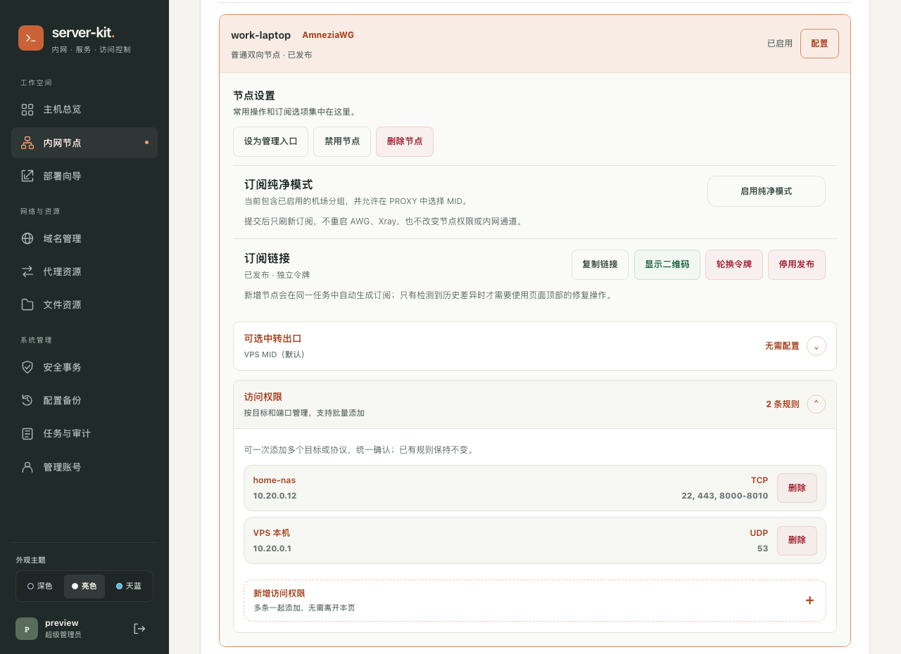
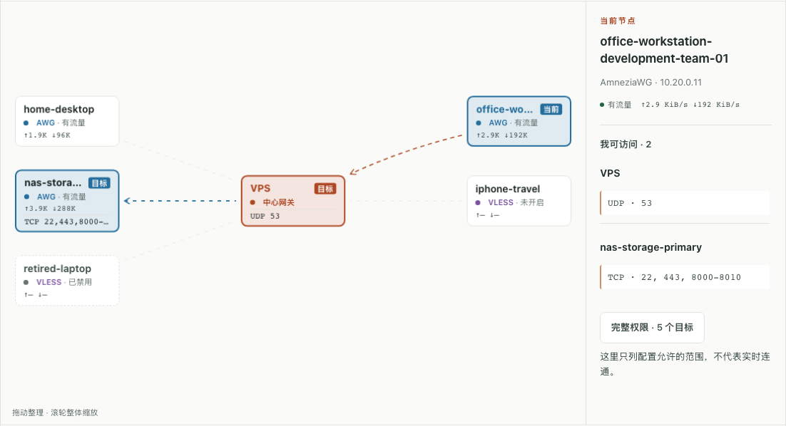
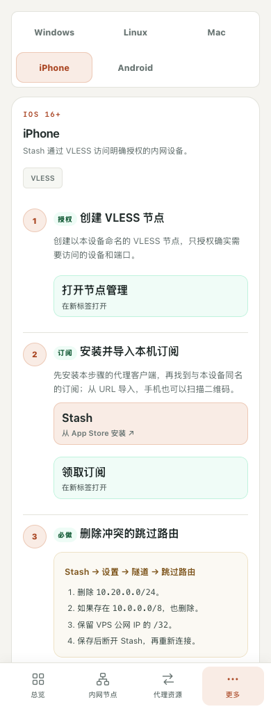

# moonsage

A star network with one Debian VPS at the center. Manage access and services in a private dashboard.

Previously server-kit. Existing deployment commands still work.

[中文](README.md) · [Easy English](README.en.md) · [Start here](#quick-start)


VPS / AWG down → private links between devices stop. Speed and delay depend on the VPS and both links. Main and backup endpoints use the same VPS: **no backup server**.

## Quick start

**Debian 12/13 · amd64 · systemd · root · kernel able to build/load AmneziaWG (AWG).** Use a fresh VPS if possible. Keep SSH and the provider's recovery console available.

| Cloud + existing host firewall | Public access |
| --- | --- |
| Your current SSH TCP port | Allow |
| Main AWG UDP (default `443`) + backup UDP | Allow; use setup's actual ports |
| Dashboard `9080/TCP` | Keep private; open other services only as needed |

### 1. VPS: install

```bash
# Run in an interactive root terminal on the VPS
apt-get update
apt-get install -y git ca-certificates python3
git clone https://github.com/je00/moonsage.git /root/server-kit
cd /root/server-kit
bash install-server-kit.sh install
server-kit preflight
server-kit init
```

Set the admin name, password, and dashboard port when asked. Setup adds **AWG + the dashboard** as needed. It leaves SSH and the host input policy unchanged; AWG sets its own forwarding and network rules.

<details>
<summary>Setup asks for a kernel / headers reboot? Check recovery access first.</summary>

Reboot as instructed, reconnect over SSH, then run:

```bash
cd /root/server-kit
bash ./server-kit init
```

</details>

### 2. Your computer: first login

Continue only after setup succeeds. Replace `SSH_PORT` and `YOUR_VPS_IP`. Use the private address and dashboard port printed by setup.

```bash
# Open another terminal; leave it running. No output is normal.
ssh -N -o ExitOnForwardFailure=yes -L 127.0.0.1:9080:10.20.0.1:9080 -p SSH_PORT root@YOUR_VPS_IP
```

Open [http://127.0.0.1:9080](http://127.0.0.1:9080) → **控制台** (Console). Sign in with your new account.

### 3. Browser: 内网节点 → 新增节点

Network nodes → Add node:


Test: [http://10.20.0.1:9080](http://10.20.0.1:9080). Use **部署向导** (Setup guide) for other devices. Each device's firewall must allow the target service.

### 4. Restrict access when needed



`访问权限 → 新增访问权限 → 再加一条 → 预览 → 确认`

Access rules → Add rule → Add another → Preview → Confirm.

**To isolate devices: add needed rules first, then remove the “all” rule.**

## View connections

`内网节点 → 连接视图 → select a node → 我可访问 / 可访问我`

Nodes → Connections → select → outgoing / incoming access.



- Colored borders + **目标/来源** badges show allowed targets/sources. Cards show ports; details show full ranges.
- One 3D graph with the VPS fixed at the center. Rotate, drag devices, or tap **自动重排** to reset the layout. On phones, tap **调整布局** to edit and **完成调整** to scroll again.
- ↑ to VPS / ↓ from VPS: total private + Internet traffic, in B/s. VLESS shows `—` when statistics are off. [Rate details](docs/node-telemetry.md)

Permissions and recent handshakes **do not prove live connectivity**. Arrows point to access destinations via the VPS.

## Optional features

| Need | Action / requirement |
| --- | --- |
| VLESS / Clash / files / Mosh | **部署向导** (Setup guide); first Clash setup needs VLESS REALITY + upstream URL + exit configuration |
| New VPS IP | **域名管理** (Domains): stable hostname + DNSPod / DuckDNS; [recovery steps](docs/public-ip-change-runbook.md) |
| Business DNS through an exit | [Exit-consistent DNS](docs/operations.md#出口一致-dns); IP location labels may still differ |
| Custom direct / DNS rules | **域名管理 → 指定直连与 DNS**; edit rules together, save, then refresh the client subscription |
| SSH / firewall | **安全事务** (Security); high-risk actions may be preview-only; pass [safety checks](docs/management-plane-design.md) before enabling; test a second connection before confirming |
| Encrypted backups / audit | **配置备份 / 任务与审计**; save the recovery password separately |

DDNS depends on network readiness and DNS caches: no zero-downtime promise.

Private rules stay in `/etc/server-kit/subscription-rules.json` on the VPS, not in Git. Updates keep them; on a new VPS, restore an encrypted backup. The repo includes domestic DNS for `byd.auto` by default. Your saved rules take priority, including removing this default.

<details>
<summary>Phone setup example</summary>

<p></p>

</details>

## Update and recover

Back up first; keep SSH open. Run from the **newly pulled source**, not a global command pointing to the old release.

```bash
# VPS · root
cd /root/server-kit
git pull --ff-only
bash ./server-kit update-web
```

Management services briefly restart. AWG / SSH / firewall settings stay unchanged. A failed health check triggers a code rollback attempt, **not a full data restore**.

```bash
server-kit status                # Dashboard
server-kit-manager.sh status     # Services
server-kit-manager.sh audit      # Configuration checks
server-kit recovery              # Recovery menu via SSH / provider console
```

| Problem | Check first |
| --- | --- |
| No dashboard | SSH tunnel, address, port |
| No AWG connection | UDP rules, client endpoint; do not disable the firewall or restart all services |

[Operations](docs/operations.md) · [Key storage](docs/local-key-generator-privacy.md) · [Stash 3.4.1](docs/stash-3.4.md)

The UI / CLI use Chinese. Images are diagrams or local demos; use your actual addresses. **Keep configurations, subscription URLs, keys, and backups private.**
